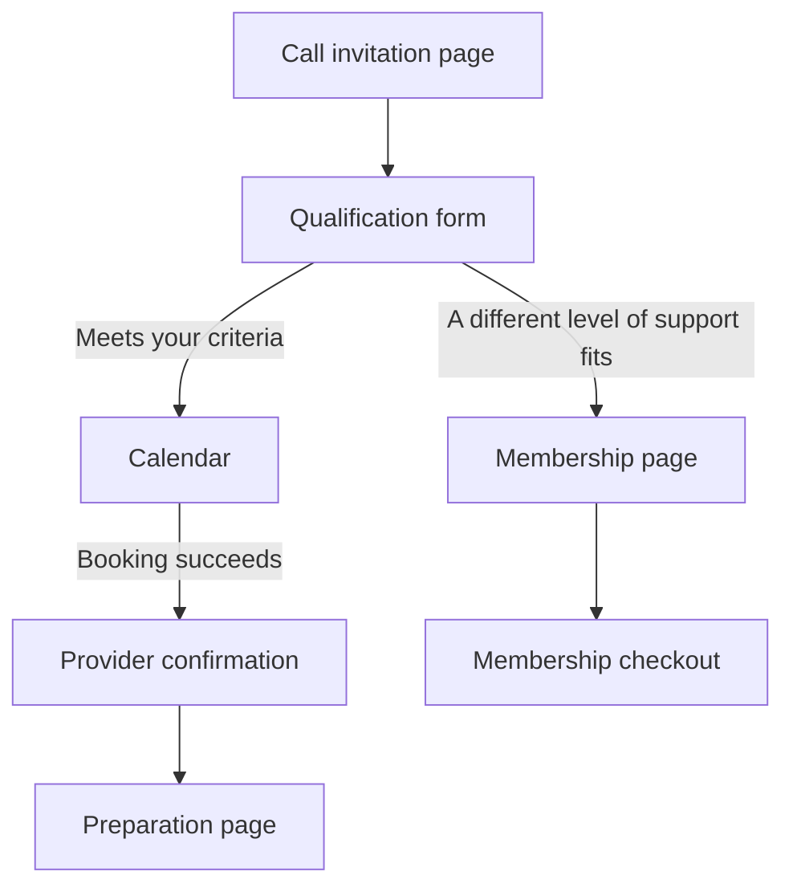

# Qualified Call + Membership funnel blueprint

This reusable blueprint is available in the Strategy step of `/admin/offers/new` and existing offer editors. It provides three editable page layouts and a downloadable setup workbook:

- **Call invitation:** explain the offer with a short video, establish fit, show approved evidence and invite an application.
- **Call preparation:** explain the process and help a prospect prepare useful questions.
- **Membership alternative:** offer a relevant level of support to people for whom the call-based offer is not currently a fit.

The blueprint shows the whole journey, including the steps configured in a form, calendar or billing provider:

## Use the template

1. Create an offer for the page you want to build. Give it a title and fill in the brief with its actual audience, problem, outcome, method and included resources.
2. Select external-link delivery. The template's buttons take visitors to your configured destination. Native download checkout does not collect application answers or book calls.
3. Choose a page role in **Qualified Call + Membership** and apply its layout. Replacing existing page content requires confirmation. Applying a layout changes the landing presentation only; it does not change product settings, prices, delivery, selected evidence, the follow-up presentation or the thank-you message.
4. Add your video and approved proof, finish the empty sections, and check every public claim. A blank section is an authoring task, not a promise supplied by the template.
5. Configure the page's destination in Delivery. Use the application URL for the invitation and the membership provider's checkout URL for the membership page. Choose the preparation page's next action to match your real process.
6. Download the workbook and configure qualification rules, both redirects, booking-success handling, reminders and membership access in the relevant providers. Test both branches before publishing.
7. Save the private draft, inspect desktop and phone previews, then publish only when the content and destination are ready.

Each page is saved as its own offer through the existing draft and publication workflow. Selecting a template does not create an entire funnel, submit an application, enroll anyone, reserve an appointment, send reminders or configure billing. The application, calendar, actual booking confirmation and recurring checkout remain in the chosen providers. An unqualified prospect should receive a useful alternative without a misleading approval or rejection claim.

## Content and measurement

The generated layouts reuse the public-facing facts entered in the brief. Private evidence notes, unanswered objections and the sending ad/email message are not copied into public sections. Testimonials, video URLs, guarantees, prices and subscription terms must be supplied and verified by the author. The workbook is a generic setup document and does not export the offer's private brief.

Only describe attendance requirements, saved video progress, cancellation rules or sent confirmations when the corresponding system actually implements them. Display the first charge, renewal amount and frequency, trial length and cancellation terms together for recurring offers; this application does not implement native subscription billing.

Measure application starts/completions, qualified bookings, attendance and provider-confirmed membership sales separately. Existing external-link clicks are not evidence of completed applications, bookings or paid memberships. Wire verified provider outcomes or use the existing verified-export reconciliation workflow where applicable.

## Reference inspection — September 26, 2026

The reference was Nicholas Kusmich's public funnel, supplied in Brian's shared note. These public pages were inspected without submitting forms, booking appointments or making purchases:

- [Entry page](https://scale.nicholaskusmich.com/) and the observed [entry variant](https://scale.nicholaskusmich.com/more-leads-now-2): short video, visible audience qualification, repeated application action and attributed proof. A separate fetch reached the `more-leads-now-1` variant; the two displayed different qualification and outcome wording.
- [Booking page](https://scale.nicholaskusmich.com/ll-booking): scheduling instructions with supporting proof. A live appointment was not created.
- [Post-booking page](https://scale.nicholaskusmich.com/more-leads-ty): preparation checklist and a link to training. Its claims about sent confirmations and enforced attendance were not independently verified.
- [Preparation page](https://scale.nicholaskusmich.com/vip-training): video preparation and questions for the call. Saved progress and automatic cancellation were not independently verified.
- [Membership alternative](https://scale.nicholaskusmich.com/council): a separate support offer for people outside the premium service's eligibility, with benefits, testimonials and repeated checkout links.
- [Linked membership checkout](https://everydayprosperity.samcart.com/products/council-membership-monthly-trial/): returned a page-not-found message during inspection. Historical prices in the note are not a verified current offer.

The template adapts the journey structure with original copy scaffolding. It does not reproduce the reference's testimonials, monetary claims, guarantee, customer identifiers, video assets or checkout links. Its conversion impact must be measured on the owner's own traffic and offer.

## Implementation and verification

Static blueprint metadata and the workbook live in `src/lib/offerBlueprints.ts`; the picker lives in `src/components/admin/offers/OfferBlueprintPicker.tsx`. Generated pages use the existing version-1 offer presentation schema and normal draft persistence. No new database schema, provider integration or paid generation job is required for the blueprint.

Regression checks cover valid layouts, fresh section IDs, private-brief isolation, existing-copy cancellation, native-delivery protection, workbook download and saving the generated page through the current editor.

Release validation: 2,376 tests across 211 files passed, along with TypeScript, lint (zero errors; existing warnings remain), formatting and production build checks. Independent code and TypeScript reviews found no blocking issues. The picker was also inspected in an isolated browser preview at desktop and phone widths; its native-delivery guard, role selection, application notice, download request and text fallback were exercised without account or database changes. Real form submissions, bookings and subscription transactions require the owner's configured providers and were not performed.
